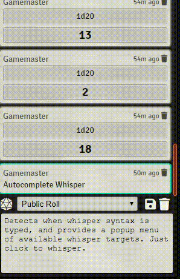

# autocomplete-whisper
Foundry VTT module to enhance chat whisper targeting with typeahead suggestions and popup menu of available targets.

* Detects when whisper syntax is typed, and provides a popup menu of available whisper targets.
* Provides typeahead suggestions as you type a target's name.  Pres TAB to autocomplete.
* Supports all known whisper syntaxes: "/whisper", "/w ", and "@".
* Supports group whisper syntaxes: "@\[target1, target2\]", "/w \[target1, target2\]" etc.

### Demo

