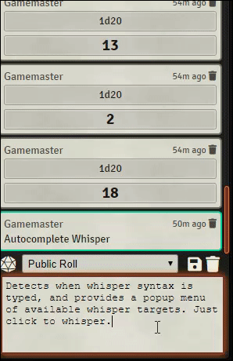

# autocomplete-whisper
Foundry VTT module to enhance chat whisper targeting with typeahead suggestions and popup menu of available targets.

* Detects when whisper syntax is typed, and provides a popup menu of available whisper targets.
* Provides typeahead suggestions as you type a target's name.  Pres TAB to autocomplete.
* Supports all known whisper syntaxes: "/whisper", "/w ", and "@".
* Supports group whisper syntaxes: "@\[target1, target2\]", "/w \[target1, target2\]" etc.

### Demo

### Release Notes

#### v0.1.0
Original release. Module approved!

#### v0.1.1
Fixes issue #12 - post-whisper ']' brackets triggering unwanted keydown handler

#### v0.1.2
* Fixes issue #11 - player name with space(s) in it not being removed from context menu after it is chosen.
* Also aims to add intelligent feature to remove all player targets if "Players" was already targeted in the array, and same for GM targets if "GM" or "DM" was already targeted. It's edge-casey, but it felt weird targeting "Players" and then having this script offer up everyone's name still as a possible target.