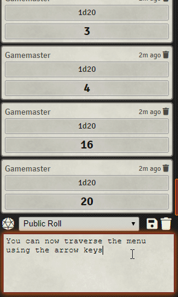

# autocomplete-whisper
Foundry VTT module to enhance chat whisper targeting with typeahead suggestions and popup menu of available targets.

* Detects when whisper syntax is typed, and provides a popup menu of available whisper targets.
* Provides typeahead suggestions as you type a target's name.  Pres TAB to autocomplete.
* Supports both known whisper syntaxes: `/whisper`, and `/w`.
* Supports group whisper syntax: `/w [target1, target2]`.
* Shift-click a name in the menu to multiselect (new in v1.0.4)!

### Demo

### Release Notes

#### v0.1.0
Original release. Module approved!

#### v0.1.1
Fixes issue #12 - post-whisper ']' brackets triggering unwanted keydown handler

#### v0.1.2
Fixes issue #11, if "Players" targeted in array the menu now hides all indiv players
* This fixes issue #11 - player name with space(s) in it not being removed from context menu after it is chosen.
* Also aims to add intelligent feature to remove all player targets if "Players" was already targeted in the array, and same for GM targets if "GM" or "DM" was already targeted. It's edge-casey, but it felt weird targeting "Players" and then having this script offer up everyone's name still as a possible target.

#### v0.2.0
Navigate up/down the player menu with the arrow keys!
* Now, when you type `/w ` and the player menu pops up, you can press the [up] or [down] key to traverse the context menu, and press [enter] to make a selection.  Great care was taken to allow the original keydown handler to continue to function correctly.
* Compatibility Note: this unbinds and rewrite the original FVTT keydown handler for chat textarea. The new handler is namespaced as `keydown.menufocus`.
* Arrow Keys Demo:  

#### v0.3.0
Removes support for '@' syntax
* The whisper syntax of `@username ` has been deprecated in Foundry v0.7.X, so regex detection of this whisper syntax has now been removed from the module.
* A settings option has been added: You can now control whether a list of GM usernames (i.e. actual names af users assigned a Gamemaster role) appears in the pop-up menu of selectable whisper targets.  The default value is false, and this will probably only apply rarely -- only for games in which there are multiple users with the GM role, and a player wishes to be able to whisper to one, but not all of them.

#### v0.3.1
Updated latest tested compatible version number to remove that pesky "compatibility risk" tag in setup.

#### v0.3.2
Updated latest tested compatible version number to remove that pesky "compatibility risk" tag in setup.
#### v0.3.3
Updated latest tested compatible version number to remove that pesky "compatibility risk" tag in setup. Sigh.

#### v0.3.4
Added support for Foundry V9.

#### v1.0.0
Updated the compatible version to get this module out of an archived status! Yikes. Also updated one misspelled word in a js comment. Calling a spade a spade: this shuold have been at a version 1 a while ago.

#### v1.0.1
v10 Compatible. Updated latest tested compatible version number to keep this from being automatically uninstalled on world migration.
#### v1.0.2
v10 Compatible. Updated compatibility values in module.json, and removed incorrect dependancy on libwrapper because it is actually independent.
#### v1.0.3
v10 Compatible. Bugfix: updated the zip file to correctly contain the latest manifest file.
#### v1.0.4
Fixed the keydown binding incompatibility issues with other modules by using @DJ4ddi's solution (thank you!). Implements shift-click to multiselect in menu.
#### v1.0.5
Tested and found to be compatible with Foundry v11. No code changes.
#### v1.0.6
Tested and found to be compatible with Foundry v12. No code changes. But I did remove some `@`-specific notes from this README, as `@` syntax was deprecated a while ago.
#### v1.0.7
Makes the structure of modules.json compliant and stop throwing an error on install.

#### v1.1.0
Update package releases to use Git Releases. Automate the release process locally a bit.